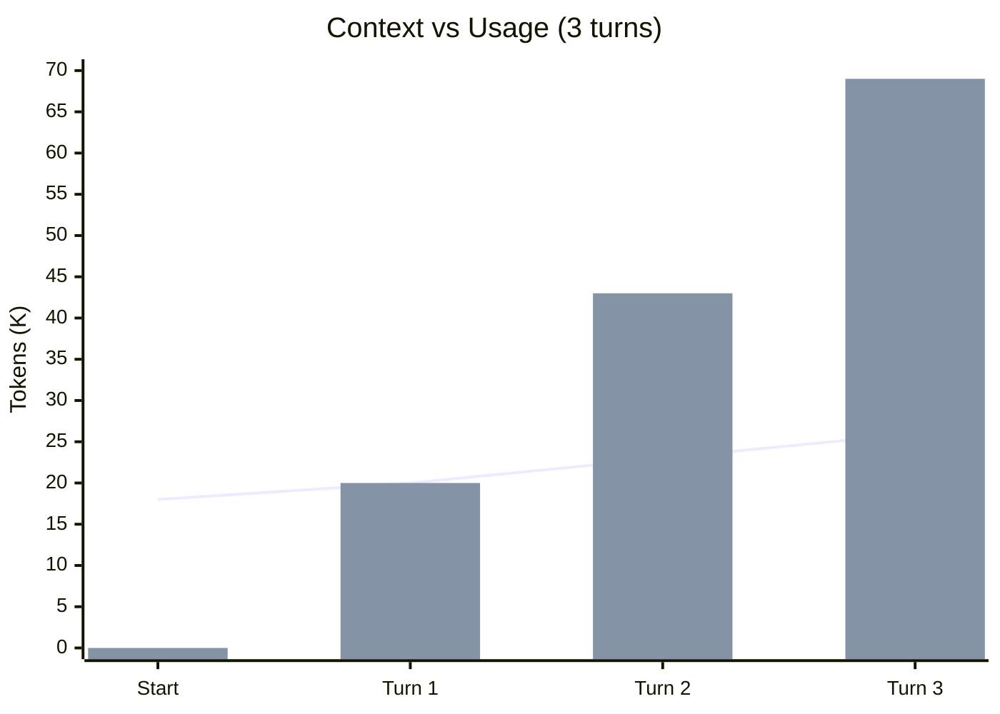
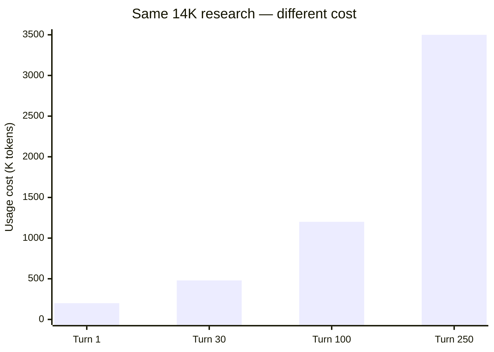

# Chart test

## Context vs Usage

Context (line) grows slowly: 18K → 26K.
Usage (bars) grows fast: 0 → 69K.

## Same research at different session depths

Same answer. 17x more expensive at turn 250.
